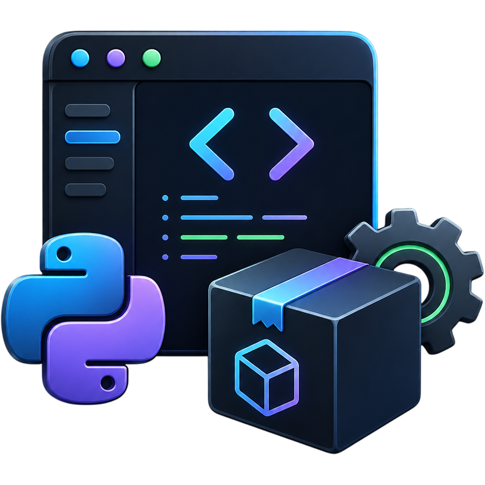

# 🚀 PyInstaller GUI — CustomTkinter Edition

Una interfaz gráfica moderna, elegante y potente para convertir tus scripts de Python (`.py`) en ejecutables independientes (`.exe`) de forma sencilla, utilizando **PyInstaller** y **CustomTkinter**.


---

## 📸 Captura de Pantalla

<p align="center">
  
</p>

---

## ✨ Características Principales

- **🎨 Interfaz Moderna**: Diseño "Dark Mode" basado en tarjetas, limpio y profesional diseñado con `customtkinter`.
- **📦 Empaquetado Completo**: Soporta modo `--onefile` (un solo archivo) y `--onedir` (carpeta con dependencias).
- **🔍 Detección Inteligente**: Localiza automáticamente el intérprete de Python incluso si la app se ejecuta como un `.exe` (usando el Registro de Windows y el PATH).
- **📂 Organización de Proyecto**: Genera automáticamente las carpetas `build/`, `dist/` y el archivo `.spec` junto al script de origen para mantener todo ordenado.
- **🖼️ Gestor de Íconos Inteligente**: 
    - Selección de imágenes en formatos comunes (PNG, JPG, WebP, BMP).
    - **Conversión automática** a `.ico` multi-resolución (16px a 256px) para una apariencia nativa perfecta en Windows.
- **⚙️ Opciones Avanzadas**:
    - **Windowed/No Console**: Oculta la consola para aplicaciones GUI.
    - **Hidden Imports**: Gestión fácil de módulos no detectados automáticamente.
    - **Add Data**: Incorpora archivos externos o carpetas en el ejecutable.
    - **UPX & Strip**: Opciones de compresión y optimización de tamaño.
- **📝 Consola en Tiempo Real**: Visualiza el proceso de compilación con logs coloreados por severidad.
- **💾 Persistencia**: Guarda y carga automáticamente tus últimas configuraciones en un archivo JSON.
- **🛠️ Auto-instalación**: El script detecta si faltan librerías críticas y ofrece instalarlas automáticamente.

---

## 🛠️ Requisitos e Instalación

### Requisitos previos
Para compilar scripts, necesitas tener instalado Python 3.7 o superior en tu sistema.

### Instalación de dependencias
El script intentará instalar lo necesario al ejecutarse, pero puedes instalarlo manualmente:

```bash
pip install customtkinter pyinstaller pillow
```

---

## 🚀 Cómo usar

1. **Seleccionar Script**: Clica en "Examinar" en la sección de Script Python y elige tu archivo `.py`.
2. **Personalizar**: 
   - Cambia el nombre del archivo de salida.
   - Selecciona un ícono (el programa lo convertirá por ti si no es `.ico`).
3. **Configurar**: Marca las opciones deseadas (recomendamos `--onefile` y `--windowed` para apps de escritorio).
4. **Compilar**: Pulsa el botón **▶ Compilar**.
5. **Listo**: Una vez termine, se abrirá un mensaje confirmando el éxito y dándote la opción de abrir la carpeta `dist/` donde reside tu ejecutable.

---

## 📂 Estructura del Proyecto

```text
.
├── py_installer.py            # Script principal (GUI)
├── icon.png                   # Imagen del icono original
├── icon.ico                   # Ícono generado optimizado para Windows
├── pyinstaller_gui_config.json # Configuración guardada
└── README.md                  # Este archivo
```

---

## 📝 Notas de Versión (v1.2)

- **Mejora de Detección**: Nuevo sistema para encontrar Python en el sistema cuando la app corre como binario.
- **Orden de Archivos**: Los archivos `build/` y `.spec` ahora se mueven automáticamente a la carpeta del script seleccionado.
- **Construcción Asíncrona**: Verificación de entorno mejorada para no bloquear la interfaz.
- **Motor de Íconos**: Construcción manual con `struct` para evitar bugs de Pillow.
- **Persistencia**: Mejora en el manejo del JSON de configuración.


---

## 🤝 Contribuciones

¡Las sugerencias y mejoras son bienvenidas! Siente la libertad de clonar el repositorio y enviar un Pull Request.

---

## ⚖️ Licencia

Este proyecto está bajo la Licencia MIT. Siéntete libre de usarlo para tus proyectos personales o comerciales.
